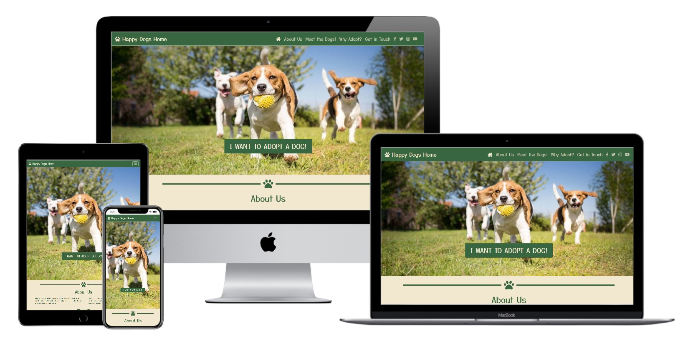
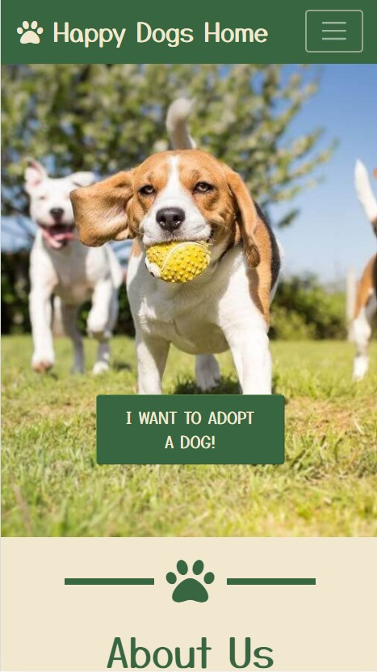
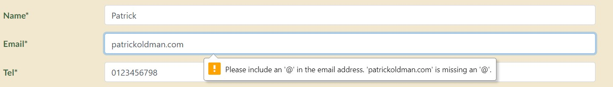
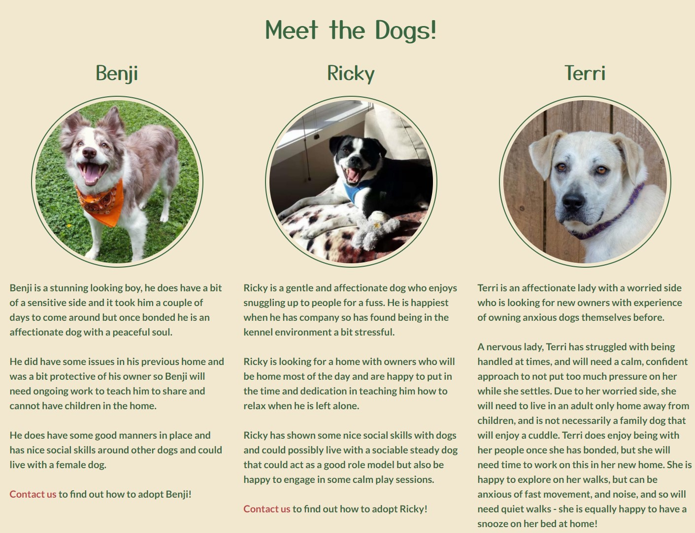
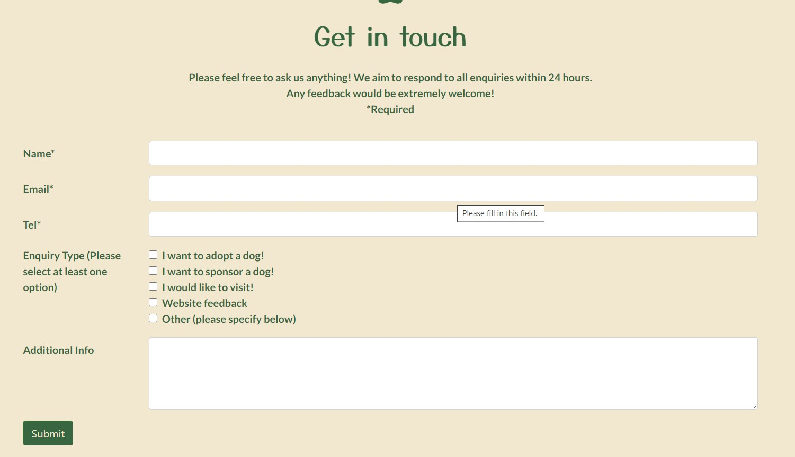
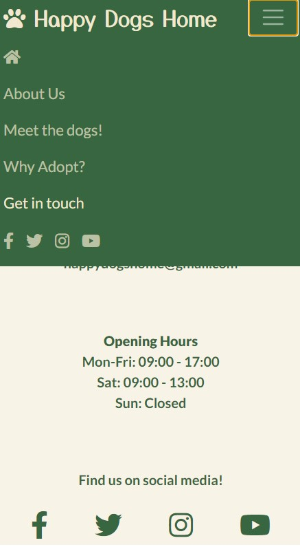
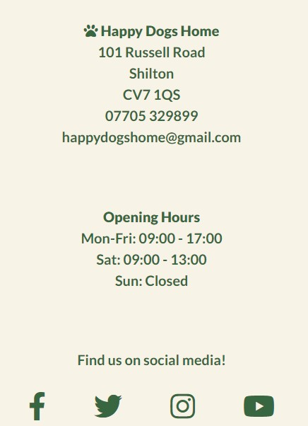
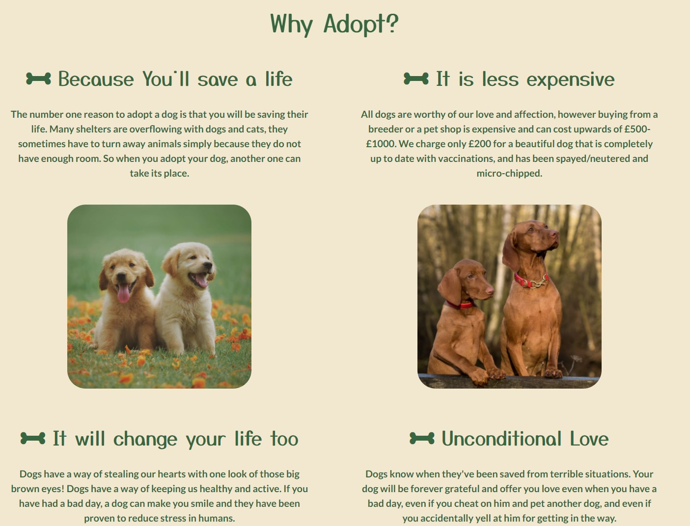
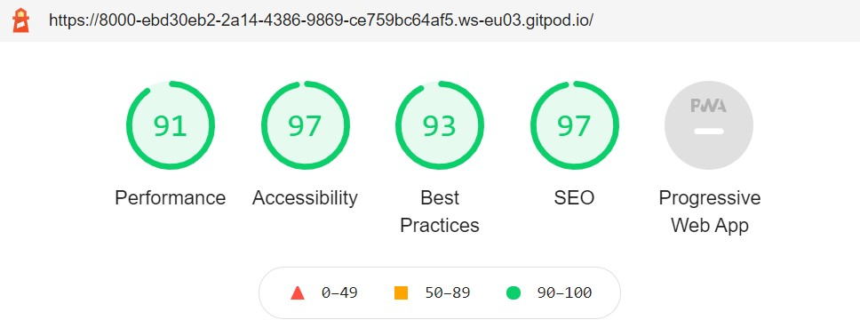
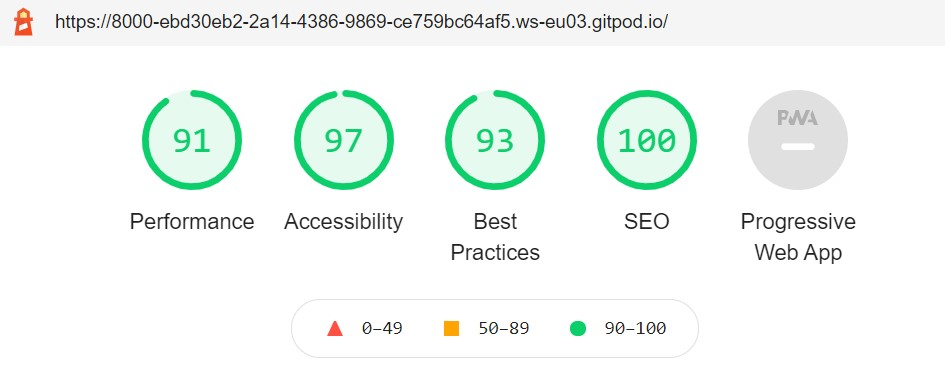

# Happy Dogs Home

# About

This is my first Milestone Project for my Full Stack Software Development Diploma with Code Institute. I will be using HTML and CSS only.

For this project I am creating a simple website for a fictional new shelter for dogs. The website is simply structured with only the most important information on show, however there is scope for future expansion.

The basic aim of the website is to introduce people to the charity and encourage visitors to adopt a dog.

## Mockup

# UXD

## Strategy

I am looking to attract as wide a range of visitors as possible. Most will be people who like dogs and may have an interest in making an adoption.

### User Stories

I am a visitor and I want:

1. To find out what this website is for
2. The site to be easy to 'learn', navigate and use 
3. To see lots of pictures of happy dogs
4. To see what dogs are available
5. To be able to easily contact the charity in order to make an adoption or make an enquiry
6. To follow the charity on social media
7. To use the site on mobile/tablet/desktop
8. To know where the charity is located

I am the website owner and I want:

1. Visitors to want to make a donation or adoption
2. To receive feedback on the new site

### Strategy Trade-off table 

Below I have created a trade-off table which directly addresses user stories above as well as further features which may not be viable now, but could be useful in future.

Opportunity/Problem | Importance | Viability
--------------------|------------|-----------
Create an online presence | 5 | 5
Show off our dogs | 5 | 5
Encourage visitors to adopt | 5 | 5
Provide means to donate online | 4 | 1
Increase social media following | 4 | 4
Blog/updates/mailing list | 3 | 2

## Scope 

The primary objective of this site is to create and develop an online presence for the new charity. This means that it is initially created as a Minimum Viable Product. This allows us to begin with the most important aspects and expand from there. We can also test what works and what doesn't. Therefore it is also sensible to provide the opportunity for visitors to give feedback so we can improve existing features and find out what new features are needed.

The strategy trade-off table above helps us work out what we can and can't implement at this stage. It also tells us what the most important features are. These are as follows:

1. Create online presence and introduce ourselves to visitors
2. Show off our dogs
3. Encourage people to adopt
4. For visitors to be able to easily contact us for anything and provide feedback

Allowing people to donate online and adding operational updates/blog is outside my current skillset, however these are important features which can be looked at in future.

## Structure 

The website initially functions as a single scrolling page in a linear structure. This is the most simple and accessible way of navigation and information display. This is ideal for this site as we are looking to attract as wide a demographic of visitors as possible. We want visitors to be engaged immediately and for them not to be overwhelmed. There are nav links on the top of the screen, which take the user to different sections of the page. This will be fixed to the top of the screen when scrolling to enable the user to access them at any time.

The top navigation links will change colour when that section is active and upon hovering to provide the user with simple visual feedback on where they are and how to get to where they want to go within the site. There are also clear dividers and headings for each section.

The submit button in the contact section also changes colour when hovering. If there is any issue with what has been submitted i.e. a required field has not been filled in then this information will be clear.

On tablet and mobile devides the nav link is compressed to the hamburger style menu as standard on smaller devices. It also includes social media links so these have maximum visiblity.

Each page section has a clear function and purpose.

### 1. Header - Logo, title & Navbar

* The logo and title are on the left with the navbar on the right. The navbar is compressed to hamburger icon when using on tablet or mobile. This helps the visitor find their way around the website as well as providing useful links to our social media pages.

### 2. Home - Hero Image 

* Large hero image of happy dogs playing with large text 'Give them a happy home'. There is a box laid over the image which takes the user directly to the contact pages with the text 'I want to adopt a dog'. The positive text and imagery instantly elicits a positive response from a visitor and makes the sites function clear.

### 3. About Us

* General information to the shelter - when/why/how we started and what our objectives are. This section is friendly and inviting to the reader. This provides the visitor with facts on who we are and what we do - reinforcing our legitimacy and providing human context.

### 4. Meet the dogs!

* Pictures and information profile about our dogs. There is scope for expansion on this section - this can link to a further page with all of our dogs included but for now is just a showcase.

### 5. Why Adopt?

* This works as a brief info/advertising section to encourage people to adopt. There will also be photos of dogs to break the page up which keeps it visually appealing and triggers further positive emotions from the user.

### 6. Get in touch

* Contact form for all enquiries. This has standard inputs for name/email/telephone. There is a checkbox list for the user to specify the purpose of their enquiry as well as a large text field to add further questions/detail. There is also a text box informing the customer that we aim to respond to all enquiries within 24 hours of receipt. Name/email/telephone/enquiry type fields are all required with the larger text box optional. This has a broad scope for the visitor who can make any enquiry needed from once place.

### 7. Footer - Contact info and social

* As is standard, we include our phone number, email address and place address on the bottom of the page. This is located immediately below the contact section so these two sections can be seen as one larger one. Opening hours also included as well as the social media links again.

## Skeleton

This is a mobile first design using bootstrap to adjust column numbers/sizes and positioning. On mobile each column will fill the screen horizontally while on larger devices we can fit more features into each horizontal space. 

[Wireframe for mobile, tablet and desktop](documentation/wireframe.pdf)

## Surface

I am using a simple colour palette generated on [Coolers.co](www.coolers.co) which will ensure visual clarity. I have opted for a green theme as this represents nature and the outdoors which suits dogs well. [Green is also the second favourite colour for both men and women as well as the easiest for the eye to process.](https://images.websitebuilderexpert.com/wp-content/uploads/2020/06/23005313/color-psychology.jpg)

<!-- Coolors Palette Widget -->

The hero image with the playing Beagles is not only eye catching for a visitor, but the colours also generally match and pair well with the colour pallette used which gives the site good visual flow from the beginning.

My chosen font is Yusei Magic for the headings and Lato for the paragraphs. These are both taken from the Google Fonts collection. Yusei Magic has a handwritten feel and gives the viewer a friendly and homely impression. Lato pairs well with Yusei Magic, is easy to read and is a commonly used font online for larger of text for this reason.

# Features

## Existing Features

* Introduction to the charity
* Photos and descriptions of our dogs
* 'Why Adopt' section encouraging people to adopt
* Contact Us form and address/contact information
* Social Media Links
* Responsive design which makes the content attractive and easily read at any screen size
* Navbar with scrollspy component which helps the user navigate around the page and know where on the page they are at any time

## Future Features

* Payment/Donation/Sponsorship options
* Blog
* General operational updates
* Mailing list
* Carousel component added to dog profile photos to show off more pictures of each dog

# Technologies used

## Languages Used

* HTML5
* CSS3

## Frameworks, Libraries & Programs Used

* [Bootstrap v4.5](https://getbootstrap.com/docs/4.5/getting-started/introduction/) - This was used to assist with general responsiveness and styling and more specifically for the navbar, scrollspy, grid layout and contact form
* [Fontawesome](https://fontawesome.com/) - This was used for all icons on the page. These were the Paw icon used in the header and dividers, the Home icon for the home button in the navbar and the bone icon used in the Why Adopt section
* [Google Fonts](https://fonts.google.com/) - I used the fonts Yusei Magic and Lato
* [Git](https://git-scm.com/) - Used for version control by utilizing the Gitpod terminal to commit to Git and Push to GitHub
* [Github](https://github.com/) - GitHub is used to store the projects code after being pushed from Git
* [Webformatter.com](https://webformatter.com/html) - Used to beautify html
* [Techsini Mockup Generator](http://techsini.com/multi-mockup/) - Used for website mockup
* [Balsamiq](https://balsamiq.com/) - Balsamiq was used to create the [wireframe](documentation/wireframe.pdf) during the design process
* MS Paint - Used to resize and crop images used
* [Coolers](https://coolors.co/) to generate the colour pallette
* [Colorcodehex](https://www.colorcodehex.com/hex-to-rgb.html) to convert hex colours to rgb colours for some translucent elements
* [TinyPng](https://tinypng.com/) to compress images to smaller file sizes

# Testing

## User Story Testing

### Visitor Goals

1. I want to find out what this website is for
    - Visitors are instantly greeted by a large hero image of playing dogs.
    - There is a large button at the top of the page reading "I want to adopt a dog"
    - The hero image covers only 80% of the viewport size. This allows the visitor to see the top of the "About Us" section below the hero image, which invites them to scroll down and find out more.
    
        

2. I want the site to be easy to 'learn', navigate and use
    - The site is a linear structure with everything located on one page. This is easy to navigate on all devices.
    - The visitor has three options from the home page.
        - They can either scroll down into the 'About Us' section, the title of which is already visible.
        - They can use the navigation bar/hamburger menu to find more sections in the site. This is located at the top of the page as standard.
        - They can hit the large button in the hero image "I WANT TO ADOPT A DOG". Not only is this a clear visual indicator of what the site is for, but also takes the user to the contact section where they can enquire about adopting a dog.
    - The navbar is fixed to the top of the page so the user can always navigate back to either a previous section or find the section they are looking for.
    - The navigation links have clear and unambiguous meanings so the user knows exactly what they are likely to find in each section.
    - If the user fills a section of the contact form incorrectly or leaves a required input blank, they will receive an error message when attempting to submit.
    
    - Once the form has been successfully submitted, the page refreshes back to the top so the user knows that it was successful.

3. I want to see lots of pictures of happy dogs
    - Visitors are instantly greeted by a large hero image of playing dogs.
    - There are further images of dogs all through the site and in each section except for the contact section.

4. I want to see what dogs are available
    - We have a 'Meet the Dogs' section advertising the dogs we currently have.
    - Each dog has a profile section with a picture and short description.
    - Each profile section contains a link to the contact page so the visitor can quickly and easily enquire about a particular dog.

        

5. I want to be easily able to contact the charity in order to make an adoption or make other enquiry.
    - We have a contact section at the bottom of the page.
    - This section allows the user to enter their basic contact information (name, email, telephone). It also allows the user to specify what they want to ask about as well as add any further information in a textbox.
    - There are several links to this section on the page.
        - In the navigation menu "contact us"
        - The 'I WANT TO ADOPT A DOG' button on the hero image takes the user directly to the contact section.
        - There is a link to the contact section in the 'About Us' section.
        - There are links to the contact section under each dog profile in the 'Meet the Dogs!' section.

        

6. I want to be able to follow the charity on social media
    - Social media links are displayed on the navbar.
    - Social media links are displayed on the footer.

        

7. I want to use the site on mobile/tablet/desktop
    - The site is built with responsive design in mind. Bootstrap grid is used for most elements in the main section to keep the layout tidy and easy to digest.
    - On smaller devices each element follows on from the next with pictures spaced between paragraph elements to keep visual appeal.
    - On larger devices elements tend to be more spaced out next to each other as this has greater visual clarity on a larger display.

8. I want to know where the charity is located
    - Our address is in the footer section as standard for most websites. Our opening hours are also visible in this section.

        

### Owner Goals

1. I want visitors to want to make a donation or adoption
    - We have plenty of pictures of happy and healthy looking dogs which should appeal to any visitor.
    - There is a 'Why Adopt' section added, with information that is intended to encourage any visitor to make an adoption with us.
        

2. I want to receive feedback on the new site
    - The option to provide feedback is requested and encouraged on the contact form section.
        

        
## Device and Browser Testing

* Chrome developer tools used throughout development to check usability on different devices/sizes. Devices "used" on dev tools include:
    - Moto G4 and Iphone 6/7/8 as these are fairly standard sizes for a mobile devices
    - Iphone 5/SE and Samsung Galaxy Fold as these are relatively narrow mobile devices
    - Pixel 2 XL and Iphone X as these are larger mobile devices
    - Ipad and Surface Pro as these are standard sizes for tablet devices
    - Ipad Pro as this is a higher resolution tablet device

* Personal devices used to check usability after deployment
    - OnePlus Nord mobile phone
    - Huawei Mediapad M5 10" tablet
    - Dell Inspiron 7577 laptop
    - Dell U2520D monitor

* Friends and family asked to check usability on their Apple mobile, laptop, desktop and tablet devices, particularly to check usability on Safari browser

* Browsers checked were Chrome, Firefox, Edge, Opera and Safari on all device types

## Problems overcome when testing

* I had difficulty changing the text colours and stylings on the navbar as these were defined by the bootstrap CSS file. Initially I added inline CSS to the index.html file to override the Bootstrap navbar-dark stylings. Later, I found a way to do this on the seperate CSS file using greater specificity to override the bootstrap stylings. The Chrome developer tools were very helpful in demonstrating exactly which elements needed to be overridden to get the look that I wanted.

* I had difficulty figuring out a way for the descriptions of the dogs to appear in a modal box for mobile/tablet displays while appearing on the page below the image on desktop displays. I found out this could be done using JavaScript, however as this is outside the scope of this project I have amended the page design so that the descriptions of the dogs will now appear on the page below the images on all displays. The structure and wireframe have been amended accordingly.

* There were issues with the navbar elements and photos in the "Why Adopt" section on Iphone 5 and Samsung Galaxy Fold screens when testing the site as these devices particularly narrow screens. I added media queries to the affected elements to make them smaller at screen widths below 372px to compensate for this. I used the same solution to fix an issue with the social media icons in the footer. For low width devices these would overrun into each other so a media query was added to reduce their size for smaller devices.

* Navbar not transforming into hamburger icon for Ipad Pro. I noticed this was because the resolution for this device was slightly over the Bootstrap large container size, so changed the breakpoint of this element to xl to fix this. The same issue was occuring on the footer section where each element was displayed horizontally rather than vertically aligned as intended. Once again I fixed the breakpoint for each element to xl to ensure that it appeared as desired.

* Chrome dev tools lighthouse run to check optimisation. The following issues were found and resolved
    - Images were of a large size and could be reduced. To remedy this I compressed all the images used on the page to quicken loading speeds.
    - Form checkbox inputs were labelled incorrectly - they all had the "for" attribute "gridCheck1" as they had been copy and pasted. These were all changed to match the appropriate label.
    - Link colours had an insufficient contrast ratio - I added an underline element upon hovering to increase accessibility.
    - No aria label on home button which would cause screen readers to ignore this important element - rectified by adding aria label "home" to this element.

## Testing results

### Final Chrome Dev tools

* 

* 

# Deployment

The project was deployed to GitHub Pages using the following steps...

1. Log in to GitHub and locate the [GitHub Repository](https://github.com/)
2. At the top of the Repository (not top of page), locate the "Settings" Button on the menu.
    - Alternatively Click [Here](https://raw.githubusercontent.com/) for a GIF demonstrating the process starting from Step 2.
3. Scroll down the Settings page until you locate the "GitHub Pages" Section.
4. Under "Source", click the dropdown called "None" and select "Master Branch".
5. The page will automatically refresh.
6. Scroll back down through the page to locate the now published site [link](https://github.com) in the "GitHub Pages" section.

# Credits

### Code

* HTML and CSS code for horizontal section dividers copied and amended as required from [templatefor.net](https://templatefor.net/best-css-dividers/)
* CSS code to position an element both horizontally and vertically within div copied from [w3schools.com](https://www.w3schools.com/howto/howto_css_center-vertical.asp)

### Bootstrap

* Bootstrap components html copied and amended for the following sections:
    - [Navbar](https://getbootstrap.com/docs/4.5/components/navbar/)
    - [Scrollspy](https://getbootstrap.com/docs/4.5/components/scrollspy/)
    - [Contact form](https://getbootstrap.com/docs/4.5/components/forms/)
* Bootstrap [grid](https://getbootstrap.com/docs/4.5/layout/grid/) classes used for layout and responsiveness.
* Bootstrap classes used in style.css file to overwrite some bootstrap default class designs.

### Images

* Hero image of playing beagles taken from [petponder.com](https://petponder.com/how-much-do-beagle-puppies-cost). No photographer credit found.
* Photo of "Benji" taken from [thedodo.com](https://www.thedodo.com/10-reasons-why-adopting-a-resc-775783452.html). Photo credit: Reddit user Skyote.
* Photo of "Ricky" taken from [thedodo.com](https://www.thedodo.com/10-reasons-why-adopting-a-resc-775783452.html). Photo credit: Reddit user CzechThisOut.
* Photo of "Terri" taken from [bigfluffydogs.com](https://bigfluffydogs.com/our-dogs/terri/). No photographer credited.
* Photo of puppies in "Why Adopt" section taken from [pexels.com](https://www.pexels.com/photo/two-yellow-labrador-retriever-puppies-1108099/). Photo credit: Chevanon Photography.
* Photo of 2 Vizsla dogs in "Why Adopt" section taken from [pexels.com](https://www.pexels.com/photo/dog-close-viszla-33287/). Photo credit: Pixabay.
* Photo in "About Us" section taken by myself.

### Text

* Text in "About Us" section copied and amended from [The Last Chance Animal Rescue](http://www.lastchanceanimalrescue.co.uk/index.html)

* All dog profile description text in "Meet the Dogs" section taken from Battersea Dogs Home website.
    - [Benji](https://www.battersea.org.uk/dogs/harley?filters=true&centre=&gender=&size=&ageRange=&status=&liveChild=&liveDog=&liveCat=&breed=&reset=&id=6932381)
    - [Ricky](https://www.battersea.org.uk/dogs/luke?filters=true&centre=&gender=&size=&ageRange=&status=&liveChild=&liveDog=&liveCat=&breed=&reset=&id=6930971)
    - [Terri](https://www.battersea.org.uk/dogs/molly?filters=true&centre=&gender=&size=&ageRange=&status=&liveChild=&liveDog=&liveCat=&breed=&reset=&id=6932376)

* Text in "Why Adopt" section copied and amended from [Rescue Dogs 101](https://www.rescuedogs101.com/top-17-reasons-adopt-dog/)

* Deployment section in Readme copied from [Code Institute Sample Readme](https://github.com/Code-Institute-Solutions/SampleREADME)

* General layout and structure of Readme inspired by [Code Institute Sample Readme](https://github.com/Code-Institute-Solutions/SampleREADME)

### Acknowledgements

* Thanks to my mentor Aaron Sinnott for his helpful advice and pointers.
* Thanks to the code institute Slack community for providing resources and tips.
* Thanks to friends and family for taking the time to look at the site and give advice on both content and user stories.